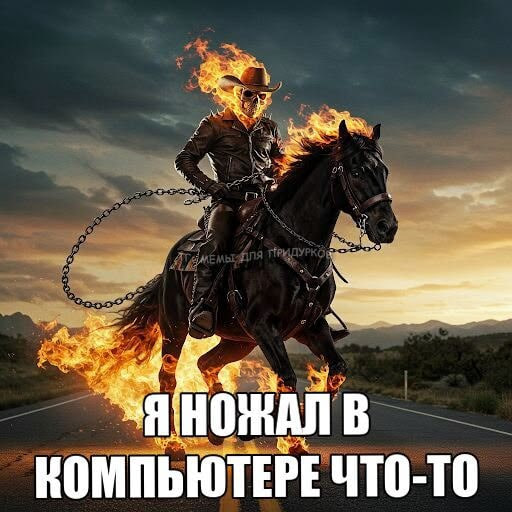

>  "Я слышу и забываю. Я вижу и запоминаю. Я делаю и понимаю." - Конфуций (551–479 гг. до н. э.)
# Лабораторная работа №1
Меня зовут Хоробрых Егор Андреевич, группа 6404-010302D, 
работаю CV-инженером.

Пишу НИР на тему "Разработка модели предобработки временных рядов на основе нейросетевых методов для экономических данных" (конкретно: формирование эмбеддингов последовательностей с помощью автоэнкодеров) под руководством научного руководителя Галанова Кирилла Валерьевича.

